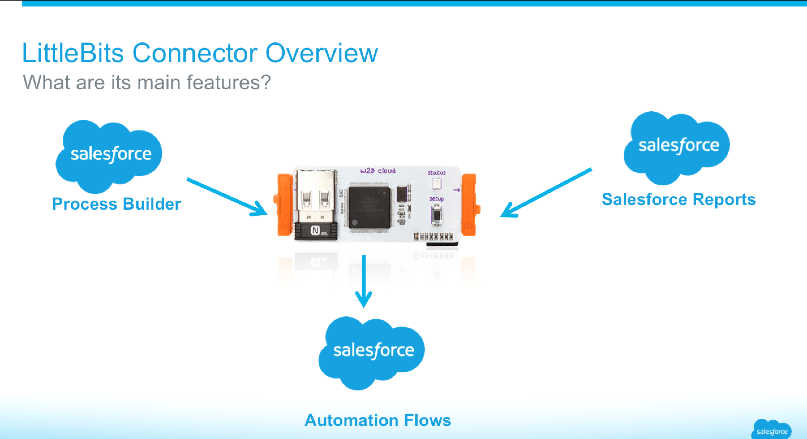
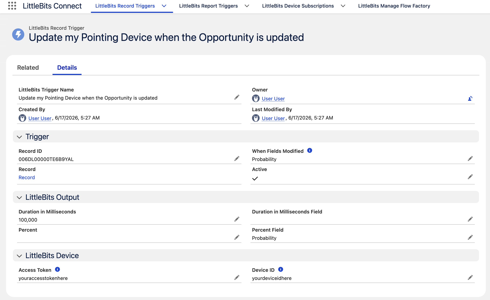
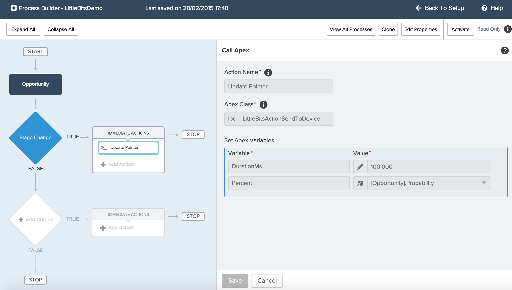
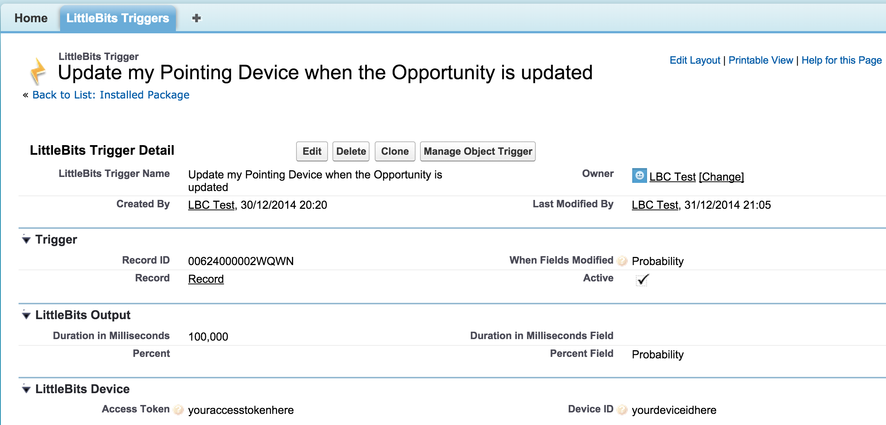

# LittleBits Connector for Salesforce

Connect [LittleBits devices](http://littlebits.cc/cloud) to Salesforce without code! Based on the **Apex LittleBits API** [here](https://github.com/afawcett/apex-littlebitsapi). Outputs to LittleBits devices when records in standard or custom objects are updated (via Process Builder) or when driven by Salesforce Reports. It can also handle notifications (events) from devices using Salesforce Visual Flow. See the following blogs for more details and examples!




- [Exploring IoT with LittleBits and Salesforce #DF15](http://andyinthecloud.com/2015/08/10/exploring-iot-with-littlebits-and-salesforce-df15/)
- [LittleBits Connector and Process Builder](http://andyinthecloud.com/2015/01/31/controlling-internet-devices-via-lightning-process-builder/)
- [LittleBits Project Opportunity Probabilty Indicator](http://littlebits.cc/projects/salesforce-littlebits-connector-opportunity-probability-indicator)
- [Introducing Salesforce LittleBits Connector Blog](http://andyinthecloud.com/2015/01/02/introducing-the-littlebits-connector-for-salesforce/)
- [Video Demo of Salesforce LittleBits Connector](https://www.youtube.com/watch?v=wFlkhZk6Yo8&feature=youtu.be)

# Package Install

You can install this connector as managed "AppExchange" package more easily. Package install links (Production and Sandbox) are listed under each version release below — see the [latest version release section](#version-117---release).



## Local Development

Use the Salesforce CLI to deploy from source to a scratch org. You need a [Dev Hub](https://developer.salesforce.com/docs/atlas.en-us.sfdx_dev.meta/sfdx_dev/sfdx_setup_enable_devhub.htm) enabled org and the [Salesforce CLI](https://developer.salesforce.com/tools/sfdxcli) installed.

**1. Authenticate to your Dev Hub**

```bash
sf org login web --alias DevHub --set-default-dev-hub
```

**2. Create a scratch org**

```bash
sf org create scratch \
  --definition-file config/project-scratch-def.json \
  --alias littlebits-scratch \
  --duration-days 7 \
  --set-default
```

**3. Deploy the package source**

```bash
sf project deploy start --source-dir force-app
```

**4. Deploy unpackaged metadata**

The sample report used by Apex tests is not part of the managed package and must be deployed separately:

```bash
sf project deploy start --source-dir unpackaged
```

**5. Assign the permission set**

Grant access to the LittleBits Connect app, tabs, and objects:

```bash
sf org assign permset --name LittleBitsConnect
```

**6. Run all tests**

```bash
sf apex run test --test-level RunLocalTests --result-format human --code-coverage --wait 30
```

**7. Open the org**

```bash
sf org open
```

Log in as the scratch org admin user. The **LittleBits Connect** app should be available after the permission set is assigned.

## Known Issues

- **Using Percent fields**. This is really a platform bug, but applies to the use of Process Builder and Flow with the Action contained in this connector. Basically Salesforce does not pass Percent values correctly to Actions there are several open issues on this topic. Fortunatly there is a workaround that both works now and will be fine to retained once they fix the issue. Pleae refer to my [updated blog here](http://andyinthecloud.com/2015/01/31/controlling-internet-devices-via-lightning-process-builder/)

## Version 1.17 - Release

- Enhancement to run **Report Triggers** from **Process Builder**
- Enhancement to run Flow's from **Device Subscriptions** under a specific User (not just Guest user)

**Updrade Note:** Add Unique Name to Report Triggers layout and add Run As User to Device Subscription layout.

Package Install Links [Production URL](https://login.salesforce.com/packaging/installPackage.apexp?p0=04t240000005jPa), [Sandbox URL](https://test.salesforce.com/packaging/installPackage.apexp?p0=04t240000005jPa)

## Version 1.12 - Release

Some signifcant new features in this release, it can now handle device events! Thanks to [Cory Cowgill](https://github.com/corycowgill) for his sample code for handling subscriptions and use of the Analytics API to process report output to the device, see the links below for links to his great work! This [blog](http://andyinthecloud.com/2015/08/10/exploring-iot-with-littlebits-and-salesforce-df15/) gives more details on how to use and configure the features, which are of course still **#clicksnotcode**!

- Enhancement [Support for Subscribing to Output from Devices](https://github.com/afawcett/littlebits-connector/issues/1)
- Enhancement [Support for using Reports as Data Source for Outputting to Devices](https://github.com/afawcett/littlebits-connector/issues/2)
- Enhancement [Optimise 'Object Trigger' functionality deployment for Summer'15](https://github.com/afawcett/littlebits-connector/issues/8)
- Internal Improvement [Utilise Queueable instead of @future](https://github.com/afawcett/littlebits-connector/issues/9)
- Internal Improvement [Internals: Re-instate OutputToDevicesJob](https://github.com/afawcett/littlebits-connector/issues/11)

Package Install Links [Production URL](https://login.salesforce.com/packaging/installPackage.apexp?p0=04t240000005ZF7), [Sandbox URL](https://test.salesforce.com/packaging/installPackage.apexp?p0=04t240000005ZF7)

## Version 1.3 - Beta

**IMPORTANT NOTE:** This is a Beta status package, it still needs more work to work to make it more robust, work within platform limits and utilise new features of the platform at this time i don't have available to me. So for now please feel free to use in your demo orgs or sandboxes, have fun and give some feedback!

- Fixed issue [Exception when creating the trigger](https://github.com/afawcett/littlebits-connector/issues/7)

Package Install Links [Production URL](https://login.salesforce.com/packaging/installPackage.apexp?p0=04t240000004uUv), [Sandbox URL](https://test.salesforce.com/packaging/installPackage.apexp?p0=04t240000004uUv)

## Version 1.2 - Beta

**IMPORTANT NOTE:** This is a Beta status package, it still needs more work to work to make it more robust, work within platform limits and utilise new features of the platform at this time i don't have available to me. So for now please feel free to use in your demo orgs or sandboxes, have fun and give some feedback!

- Fixed issue [Remove workaround to Percent field mapping when using Process Builder](https://github.com/afawcett/littlebits-connector/issues/6)

Package Install Links [Production URL](https://login.salesforce.com/packaging/installPackage.apexp?p0=04t240000004uUq), [Sandbox URL](https://test.salesforce.com/packaging/installPackage.apexp?p0=04t240000004uUq)

## Version 1.1 - Beta

**IMPORTANT NOTE:** This is a Beta status package, it still needs more work to work to make it more robust, work within platform limits and utilise new features of the platform at this time i don't have available to me. So for now please feel free to use in your demo orgs or sandboxes, have fun and give some feedback!

This version now support [Lightning Process Builder](https://help.salesforce.com/HTViewHelpDoc?id=process_overview.htm), take a look at my [blog post](http://andyinthecloud.com/2015/01/31/controlling-internet-devices-via-lightning-process-builder/) for more information, have fun!



Package Install Links [Production URL](https://login.salesforce.com/packaging/installPackage.apexp?p0=04t240000004tdG), [Sandbox URL](https://test.salesforce.com/packaging/installPackage.apexp?p0=04t240000004tdG)

## Version 1.0 - Beta

**IMPORTANT NOTE:** This is a Beta status package, it still needs more work to work to make it more robust, work within platform limits and utilise new features of the platform at this time i don't have available to me. So for now please feel free to use in your demo orgs or sandboxes, have fun and give some feedback!

This version supports **LittleBits Triggers** and allows you to output to a device from any custom or standard object based on a given field or fields changing. The percent and duration of the output can be driven by fields on the record. For example Opportunity object based on the Probability changing updates your device!



Package Install Links [Production URL](https://login.salesforce.com/packaging/installPackage.apexp?p0=04t240000004kmO), [Sandbox URL](https://test.salesforce.com/packaging/installPackage.apexp?p0=04t240000004kmO)

**IMPORTANT NOTE:** This version does not validate the fields entered into the LittleBits Trigger definition, be careful to enter these accuratly, using the demo screenshot as a guide. The trigger submits an ApexJob in the background, if it is not sending output to your device, go to the Setup menu and check under Apex Jobs for any error messages.

# Code

This project uses the [Salesforce DX](https://developer.salesforce.com/tools/sfdxcli) source format. Metadata lives under `force-app/main/default/`. See [Local Development](#local-development) above for deploy and test instructions.

### Prerequisites

- [Salesforce CLI](https://developer.salesforce.com/tools/sfdxcli)
- Node.js (for formatting and lint tooling)

```bash
npm install
```

### Regenerate Apex mocks

If you change interfaces used by the mock generator:

```bash
ant -f build.xml
```

### Package development

Package IDs and aliases are configured in `sfdx-project.json` for 2GP releases under the `lbc` namespace.
